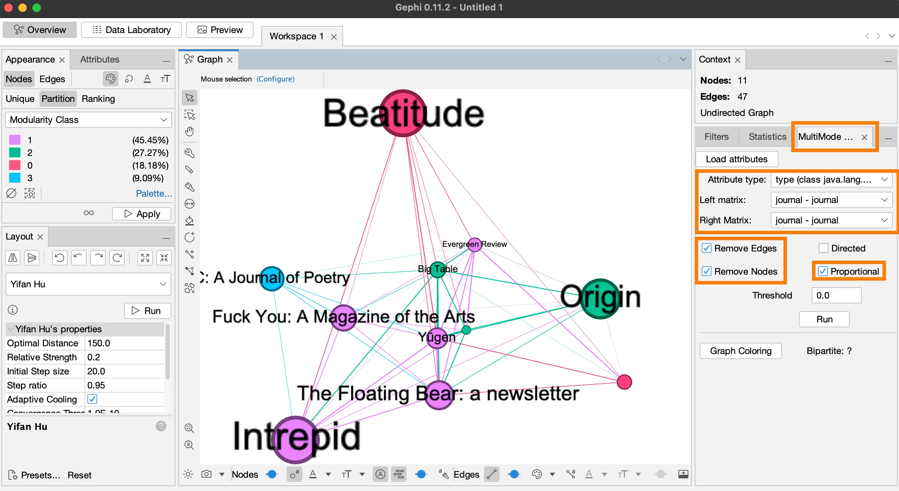
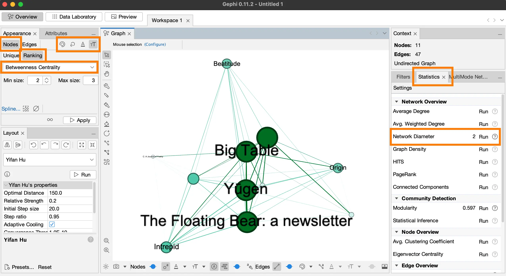
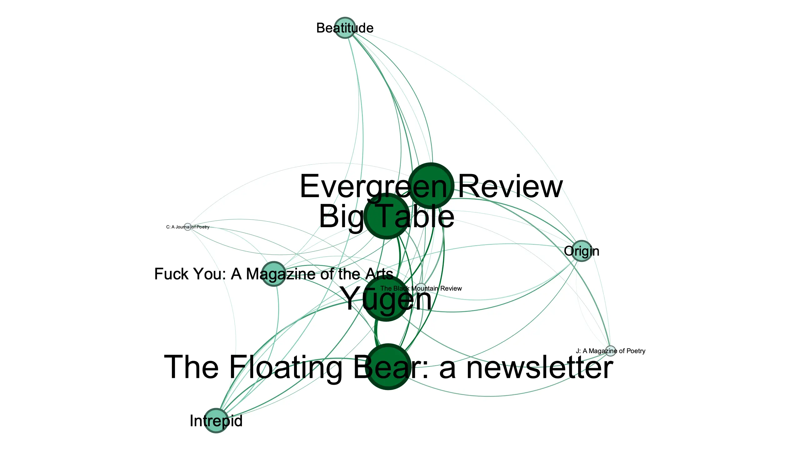

In our previous post, we used Yifan Hu, a clustering algorithm, for rendering communities visible. 
In this post, we will use centrality measure to identify the important nodes in the network.

Let’s work on a copy of the file yifanhu.gephi.

### Step 1: Install multimodal networks transformation plugin

- Make a copy of the **yifanhu.gephi** file and rename it **betweenness.gephi**.
- Open gephi and select this file.

Let’s install the **Multimodal Networks Transformation** plugin.

- In the menu bar on top, click **Tools** > **Plugins**.
- In the **Plugins** dialog box, select **Available Plugins** tab, find **Multimodal Networks Transformation** plugin and install it.

Our network graph has two dimensions, journals and poets. 
A centrality measure computes the centrality of a node relative to all other nodes in the graph. 
Since each journal node will have higher degree of connections than poet nodes, our centrality measure will be skewed in favor of the journal nodes. 
In order to level the field, let’s convert our journal-poet graph to journal-journal graph.

## Step 2: Convert the bimodal graph to unimodal graph

·	Click the **Multimodal Networks Trasformation** tab, the panel on the right **(fig. 1)**.
·	Click **Load Attributes** > select **Attribute type: type String** > **Left matrix journal – poet** > **Right matrix poet-journal**.
·	Check **Remove Edges**, **Remove Nodes**, and **Proportional**.
·	Click **Run**.
·	Click **Center the graph** (magnifying glass).

<figcaption>**Figure 1.** Unimodal graph with journal-journal connections.</figcaption>

Next, we will calculate betweenness centrality for each node. 
A node has high betweenness, compared to other nodes, if it is positioned between two or more unconnected nodes. 
In other words, in order for something to "flow" between nodes or between communities, this node with high betweenness acts as an intermediary.

### Step 3: Betweenness centrality
- Go back to the **Statistics** tab **(fig. 2)**, and **Run** the **Network Diameter**. 
In the **Graph Distance Settings** dialog box, check **Normalise Centralities**. 
In the HTML report dialog box, click **Close**.

We will change the node size, node color, and node label size based on this measure.

- Change node color: In the *Nodes* tab, select **Color** (color palette icon), then **Ranking** > **Choose an attribute** > **Betweenness Centrality** > **Apply**.
- Change node size: In the **Nodes** tab, select **Size** (ring icon), then **Ranking** > **Choose an attribute** > **Betweenness Centrality** > **Min Size 20** > **Max Size: 120** > **Apply**.
- Change label size: In the **Nodes** tab, select **Label size** (TT icon), then **Ranking** > **Choose an attribute** > **Betweenness Centrality** > **Min Size 2** > **Max Size: 3** > **Apply**.
- Save the file: *File* > **Save**.

<figcaption>**Figure 2.** Betweenness centrality.</figcaption>

Let’s export the image

### Step 4: Export the image

- Go to the **Preview** tab, and under **Presets**, select **demo**.
 Go to the **Export** option at the bottom left of the screen, click on **SVG/PDF/PNG**. 
 Change image settings: **Click on Options...** In this dialog box, change **Width 2560** > **Height 1440** > **Ok**. 
 Save the image in the **begin** folder: **Save In** > **gephi-intro** folder > **begin** folder > **Files of Type: PNG files** > **File Name: betweenness.png** > **Save**.

The final result looks like this **(fig. 3)**. 
We can see that the nodes with high degree centrality, i.e., higher number of connections—*Origin*, *Beatitude*, and *Intrepid* **(fig. 2)**—are not the important nodes because they lie on the periphery of the graph, and they don’t position themselves as intermediaries. 
On the other hand, **Evergreen Review** has low degree centrality **(fig. 2)**, but it has high betweenness centrality **(fig. 3)**, which makes in an important actor in the field.
Go back to the **Overview** tab and hover over the **Evergreen Review** node to see its connections as well as its position between nodes.

<figcaption>**Figure 3.** Important nodes in the nework. *Evergreen Review* has low degree centrality **(fig. 2)** but high betweenness centrality.</figcaption>
