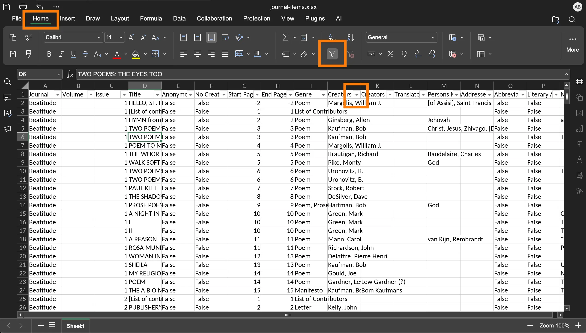
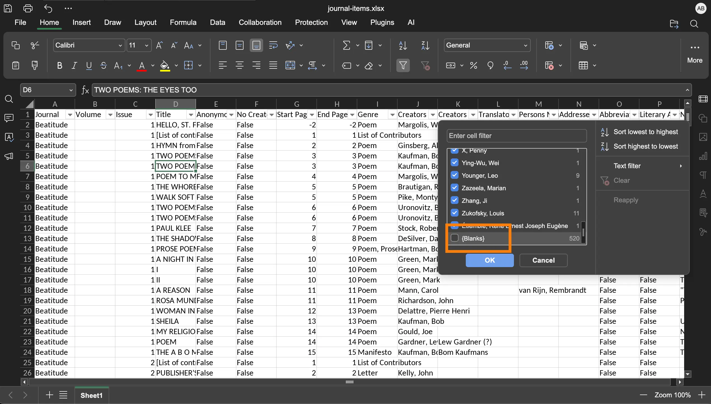
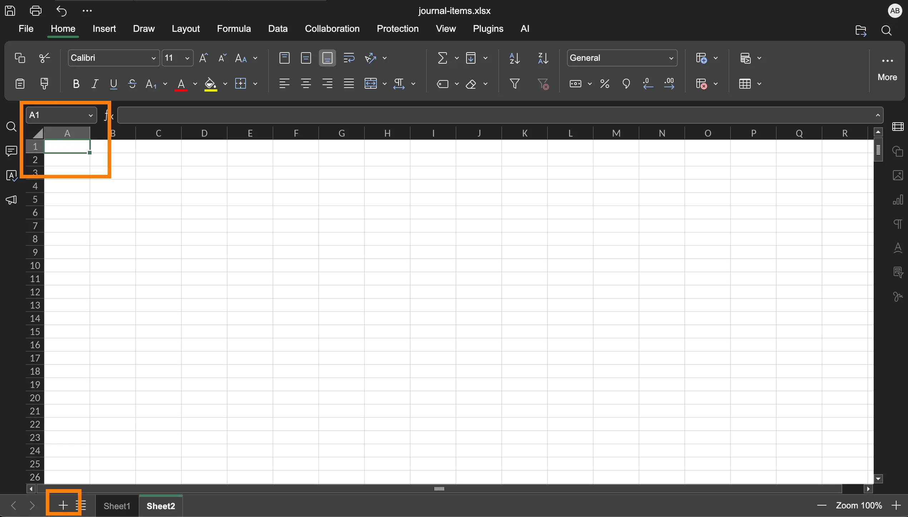
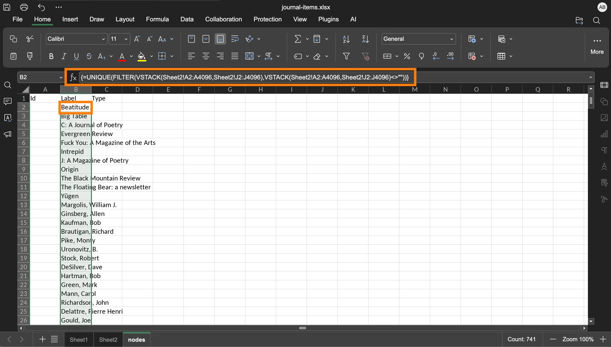
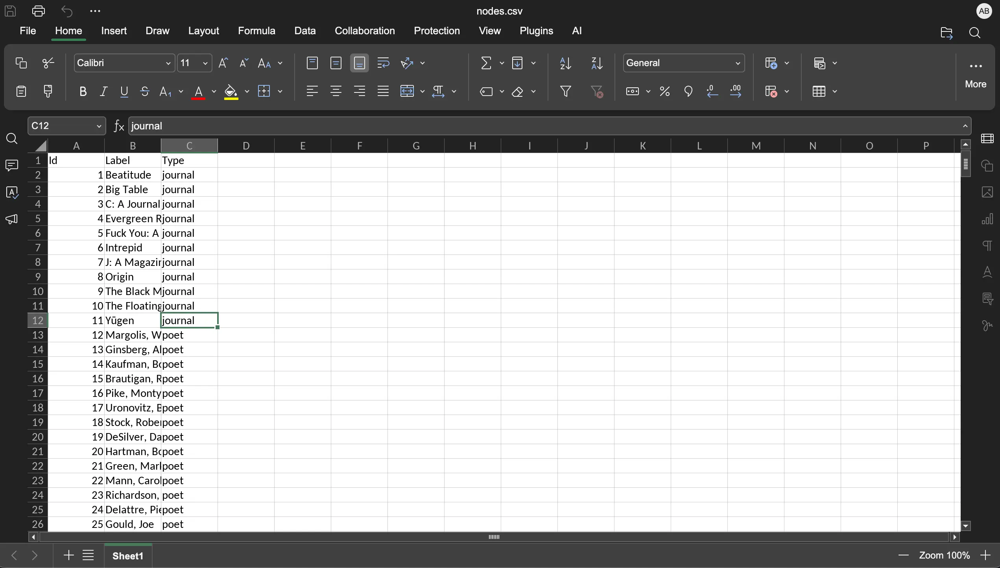
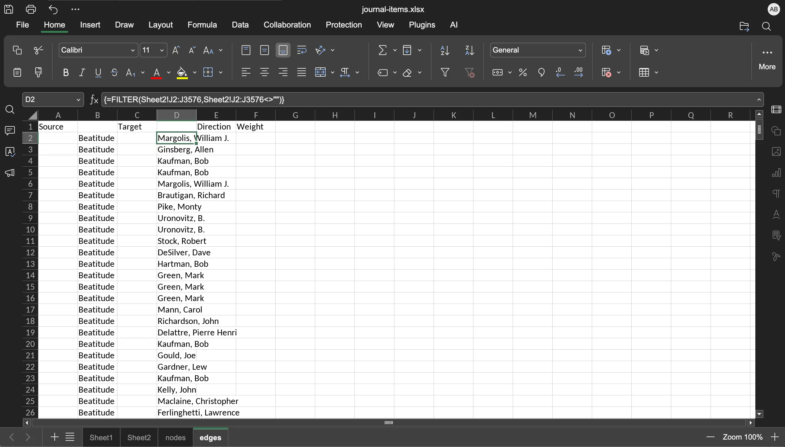
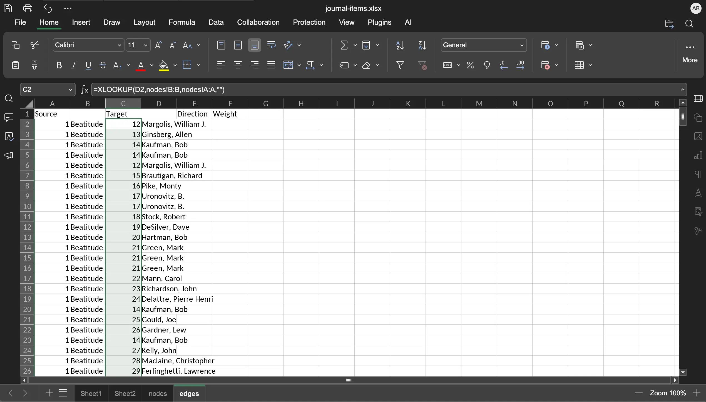
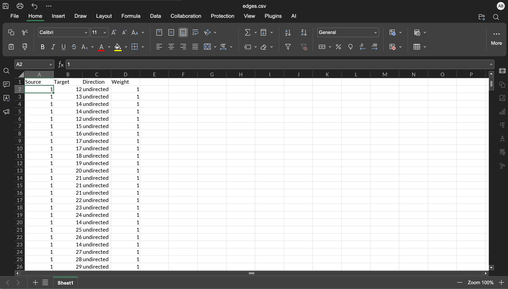

In this post, I will list the steps I took to create nodes and edges files using the original dataset from the _Networking the New American Poetry_ project. 
The dataset is titled **journal-items.csv**, which you can also download from the Github repository for this demo.

**Data Source:** [Networking the New American Poetry](https://danowski.digitalscholarship.emory.edu/nnap/download/)\
**Github Repository:** gephi-intro **[add link from Github]**

FYI, I used ONLYOFFICE spreadsheet to clean the file and restructure the dataset.
The following steps will more or less remain the same when you use other spreadsheet softwares,
but you will have to change the formulae.

### Step 1: Clean the dataset

- Open the **journal-items.csv** file and save the spreadsheet in **.xlsx** format: **File** > **Save As...**

Column J has the author names. Many cells in this column are blank. 
Filter all rows in the spreadsheet with blank cells in this column.

- Click on any cell, go to the **Home** tab and click the **Filter** button, shaped like a funnel. 
A dropdown icon appears in all of the column headers **(fig. 1)**.


<figcaption>**Figure 1.** Show the Filter button on the headers.</figcaption>

- In **column J**, click the dropdown icon, uncheck the **Blanks** option, and click **Ok**. 
The Blanks option is at the end of the list **(fig. 2)**.
- Save the file. **File** > **Save** or **Cmd + S** (**Ctrl + S** on Windows).

It is important that you save the file. We're done working on this sheet, and it's important that you save it.


<figcaption>**Figure 2.** Remove the empty cells in column J (Creators).</figcaption>

Filtering the rows hides the row only, which we don’t want in our spreadsheet. 
Copy the filtered dataset into a new sheet.

- Click the plus icon **+** at the bottom left of the spreadsheet to add a new sheet, titled Sheet2 **(fig. 3)**.
Go to **Sheet1**, click on any cell, press **Cmd + A** (**Ctrl + A** on Windows) to select all of the cells and **Cmd + C** (**Ctrl + C** on Windows) to copy the selected cells.
- Go to **Sheet2**, click on cell **A1**, and press **Cmd + V** (**Ctrl + V** on Windows) to paste the dataset **(fig. 3)**.
- Save the file. **File** > **Save** or **Cmd + S** (**Ctrl + S** on Windows)


<figcaption>**Figure 3.** Add a new sheet (bottom), click cell A1 (top).</figcaption>

### Step 2: Create nodes file

We need two files to create a network in Gephi, **nodes.csv** and **edges.csv**. 
Let’s create the first one.

- Add a new sheet, **Sheet3**, and **Rename** it nodes. Right-click on Sheet3 to see the Rename option.
- In this nodes sheet, add the following labels as headers: **Id** (column A), **Label** (column B), and **Type** (column C).

The nodes.csv file is basically a list of all journals and author names from Sheet2. 
We will use a formula to copy the unique names from columns A and J from Sheet2. 
If the formula gives an error message, copy the error message and the formula and ask Google AI. 
You'll most likely have to revise the formula if you’re not using ONLYOFFICE.

- Click on cell **B2**, click on the **Formula Bar** next to the **fx** button **(fig. 4)**, copy and paste this formula, and press **Return** (**Enter** for Windows): 
```excel
=UNIQUE(FILTER(VSTACK(Sheet2!A2:A4096,Sheet2!J2:J4096),VSTACK(Sheet2!A2:A4096,Sheet2!J2:J4096)<>""))
```


<figcaption>**Figure 4.** Paste the forumla in the Formula Bar to fill column B (Label) with a list of unique names (journals + authors) from Sheet2.</figcaption>


Next, we will give each row a unique numerical Id. 
The formula below fills all cells in column A (Id) with numerical values 1 through 741, 
which correspond to the 741 items in column B (Label).

- Click on cell **A2**, click on the **Formula Bar**, copy and paste this formula, and press **Return** (**Enter** on Windows): 
```excel
=SEQUENCE(COUNTA(B2:B5000))
```

In column C (Type), we will identify the journals as journal and authors as poet. 
You can identify them using other categories, such as institution/member or container/content, as long as they make sense to your reader. 
Rows B2 to B12 are journals and rows B13 onward are poets.

- Click on cell **C2**, click on the **Formula Bar**, copy and paste this formula, and press **Return** (**Enter** on Windows): 

```excel
=IFS(ROW(B2:INDEX(B:B; COUNTA(B:B)))<=12; "journal"; ROW(B2:INDEX(B:B; COUNTA(B:B)))>12; "poet")
```

- Save the file: **File** > **Save** or **Cmd + S** (**Ctrl + S** on Windows)
- Save this nodes sheet in .csv format: **File** > **Save As...** > **nodes** (filename) and **Comma Separated Values .csv** (File Format).

The nodes.csv file will look like this **(fig. 5)**. 


<figcaption>**Figure 5.** Nodes.csv file.</figcaption>


### Step 3: Create edges file

We will create the edges.csv file next. 
The edges file has journal in the Source column and poet in the Target column; 
however, we will eventually replace the journal name and poet name with their corresponding numerical IDs from the nodes sheet.

- Add a new sheet to our **journal-items.xlsx** file, and **Rename** it **edges**.
- Add the following headers: **Source** (column A), **blank header** (column B), **Target** (column C), **blank header** (column D), **Direction** (column E), **Weight** (column F). 

We will first add the journal titles from all rows from Sheet2 to this edges sheet.

- Click on cell **B2**, click on the **Formula Bar**, copy and paste this formula, and press **Return**: 

```excel
=FILTER(Sheet2!A2:A3576,Sheet2!J2:J3576<>"")
```

Let’s do the same for the poet names.

- Click on cell **D2**, click on the **Formula Bar**, copy and paste this formula, and press **Return**: 

```excel
=FILTER(Sheet2!J2:J3576,Sheet2!J2:J3576<>"")
```

The result so far looks like this **(fig. 6)**. 
The edges spreadsheet has 3576 rows, and the last row has Yūgen (journal) and Lett, Paul (poet), the same items you’ll find at the end of Sheet2.


<figcaption>**Figure 6.** Edges sheet with journal names (column B) and poet names (column D).</figcaption>


Gephi takes numerical IDs for Source and Target columns, 
so we will have to match the journal name and poet name with the corresponding numerical IDs from the nodes sheet.

- Click on the **Name Box** on the left of the **Formula Bar** **(fig. 7)**, type **A2:A3576** on the **Name Box**, and press **Return**. 
This will select all cells in column A. 
Click on the **Formula Bar**, copy and paste the following formula, and press **Cmd + Return** (**Ctrl + Enter** on Windows).  

```excel
=XLOOKUP(B2; nodes!B:B; nodes!A:A; "")
```

- Click on the **Name Box** again, type **C2:C3576** on the **Name Box**, and press **Return**. This will select all cells in column C. 
Click on the **Formula Bar**, copy and paste the following formula, and press **Cmd + Return** (**Ctrl + Enter** on Windows): 

```excel
=XLOOKUP(D2,nodes!B:B,nodes!A:A,"")
```

The resulting edges sheet should look like this **(fig. 7)**. 


<figcaption>**Figure 7.** Edges sheet filled with numerical IDs in Source and Target columns. The marked area is the **Name Box**</figcaption>


I have ONLYOFFICE, and this was the only way I could fill the whole column with the formula. 
If you’re on Microsoft Excel, there are easier ways to fill a column with the formula.

The next step is to fill the columns E (Direction) and F (Weight). 
We will fill E with **undirected** for direction and F with **1** for weight.

- Click on cell **E2**, click on the **Formula Bar**, copy and paste the following formula, and press **Return**:

```excel
=IF(ROW(E2:E3576); "undirected")
```

- Click on cell **F2**, click on the **Formula Bar**, copy and paste the following formula, and press **Return**:

```excel
=IF(ROW(F2:F3576),1)
```

- Save the file. **File** > **Save** or **Cmd + S** (**Ctrl + S** on Windows)
- Save this edges sheet in .csv format: **File** > **Save As...** > **edges** (filename) and **Comma Separated Values .csv** (File Format).
- Open the **edges.csv** file, delete columns **B** and **D** (the ones with journal and poet names). 
Save the file: **File** > **Save** or **Cmd + S** (**Ctrl + S** on Windows)

The final edges.csv file looks like this **(fig. 8).


<figcaption>**Figure 8.** Edges.csv file</figcaption>

This was a lot of work, and I'm pretty sure you'll encounter technical difficulties when cleaning and restructuring your dataset.
I hope this post gave you a good idea regarding the steps necessary to create the nodes and edges files.