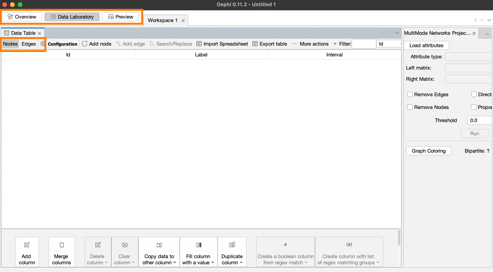
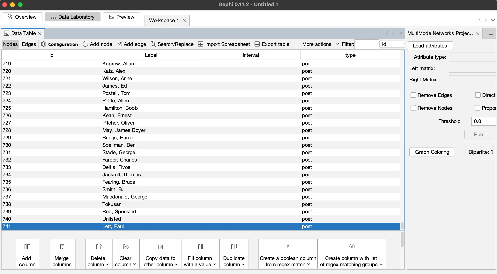
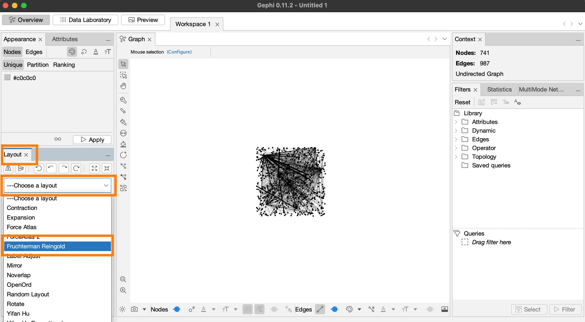
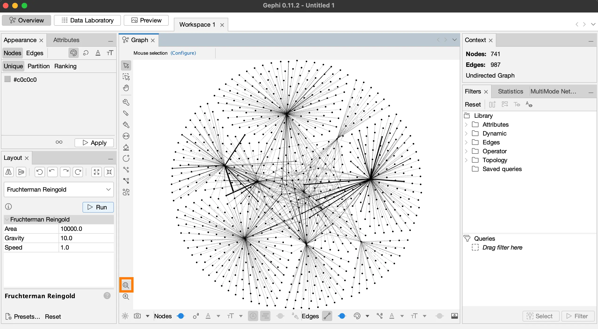
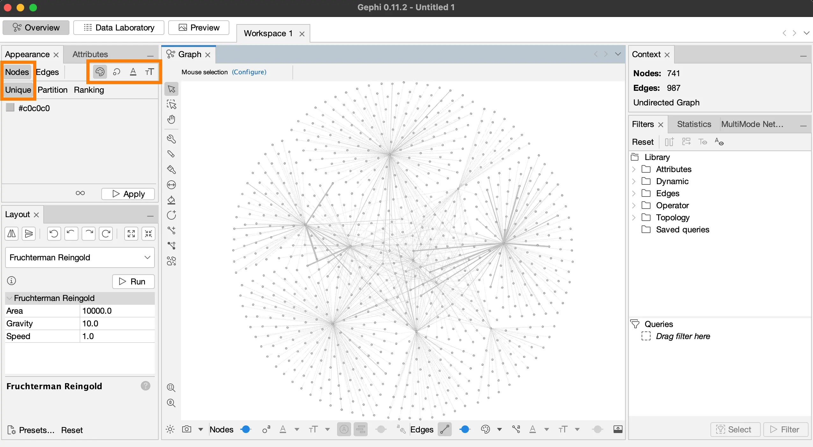
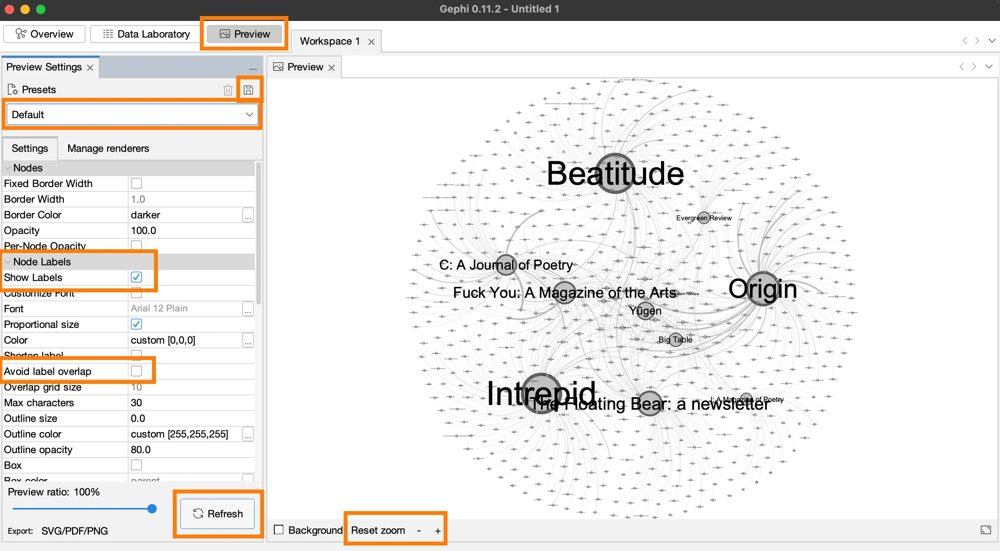
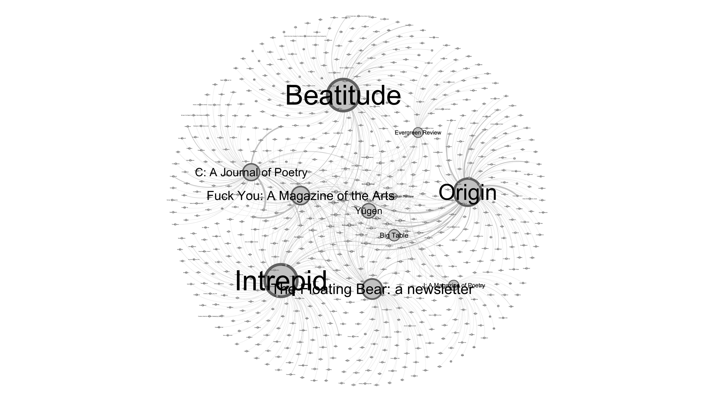

In this demo, I will show you how to create visualizations from the nodes and edges files in Gephi.

### Step 1: Upload the nodes and edges files on Gephi

Once you open Gephi, you’ll see many project options. 
There are preloaded sample projects you can explore once you know your way around Gephi. 
For now, we will create a new project.

- Open Gephi and click on **New Project**.

There are three tabs on the top left side of the screen. 
We will create the network diagram in the **Overview** tab, 
upload our nodes and edges files in the **Data Laboratory** tab, 
and export our visualization in the **Preview** tab.

Let’s work in the **Data Laboratory** tab.

- Click on the **Data Laboratory** tab **(fig. 1)**. 

<figcaption>**Figure 1.** Data Laboratory screen.</figcaption>

Below these tabs, you will see the **Data Table** tab, which has **Nodes** and **Edges** section to upload our files.

- Click on **Nodes**, and click on **Import Spreadsheet**, which is on the middle of the same bar as the Nodes tab.

We will have to work with several dialog boxes.

- In the **Open** dialog box, locate the **nodes.csv** file, which is inside our working folder: **gephi-intro** > **begin** > **nodes.csv**. Click **Open**.
- In the **Spreadsheet (CSV)...** dialog box, click **Next** and **Finish**.
- In the **Import Report** dialog box, select **Graph Type: Undirected**, and check **Append to existing workspace**.

This will populate the Nodes table **(fig. 2)**. Scroll down to the end of this Nodes table, and you’ll see that we have 741 nodes.

<figcaption>**Figure 2.** Nodes table is populated.</figcaption>

The process for importing the edges file is the same. 

- In the **Open** dialog box, locate the **edges.csv** file, which is inside the same working folder as the nodes file: **gephi-intro** > **begin** > **edges.csv**. Click **Open**.
- In the **Spreadsheet (CSV)...** dialog box, click **Next** and **Finish**.
- In the **Import Report** dialog box, select **Graph Type: Undirected**, and check **Append to existing workspace**.

According to the end of the Edges table, there are 3574 edges.

Let’s save this file. 
It’s important that we do this after completing each step. 
Unfortunately, Gephi doesn’t have an undo button, so saving the file whenever you’re satisfied with your result is necessary. 
Think of this as a checkpoint that you can return to if you don’t like the steps you took.

- Save the file as networking.gephi: **File** > **Save** > select **gephi-intro** folder > select **begin** folder > **networking.gephi** (File Name) > **Save**.

Let’s head over to the **Overview** tab to create our first network diagram.

### Step 2: Create a network diagram

- Click on the **Overview** tab, which is on the left side of the **Data Laboratory** tab.
- There is a **Layout** panel on the left side of the screen **(fig. 3)**. Select Fruchterman Reingold layout: **Choose a layout** > **Fruchterman Reingold** > **Run**.

<figcaption>**Figure 3.** Run the Fruchterman Reingold algorithm.</figcaption>

It will take some time before the simulation stops running. 
The forces will come to an equilibrium once the algorithm finds the optimal position for the nodes.

- Click **Stop** once the simulation stops moving.
- There are two magnifying glasses on the bottom left corner of the diagram **(fig. 4)**. 
Click on the one on top called **Center on Graph**. 
- Save the file: **File** > **Save**.

The graph should be on the center of the screen and occupy most of the space. 
If the graph is really small and not on the center of the screen, it most likely means that there are isolated nodes, which can be a problem.

<figcaption>**Figure 4.** If the graph is at the center, it means it doesn't have isolated nodes.</figcaption>

Next, we will change color and size of the nodes and add labels.

- In the **Appearance** panel (top left side of the screen), click on the Nodes tab, and you’ll see icons for Color, Size, Label Color, Label Size **(fig. 5)**.
- Change the color of nodes to gray color: **Nodes** tab > **Color** tab (color palette icon) > **Unique** tab > **Apply**. 

<figcaption>**Figure 5.** Change the color of nodes to gray.</figcaption>

- Change the size of the nodes based on their degree of connections: **Nodes** tab > **Size** tab (ring icon) > **Ranking** > **Choose an attribute** > **Degree** > **Min size: 10**, **Max size: 150** > **Apply**.
- Change the label size for nodes based on their degree: **Nodes** tab > **Label Size** tab (TT icon) > **Ranking** > **Choose an attribute** > **Degree** > **Min size: 5**, **Max size: 8** > **Apply**. 
Follow the next step if the node labels do not appear.
- Click on the **More Settings** pop up icon on the bottom right corner of the figure, then **Node Labels** > check **Show**.
- Change the font weight too: **Node Labels** > **Font: Arial-BoldMT, 32** > **Style: Regular** > **Ok**.
- Save the file: **File** > **Save**.

We are ready to export our diagram as an image. 
Let’s head over to the **Preview** panel.

Step 3: Export images

- Click on the **Preview** tab.
- To view the image, click **Reset** and **Refresh**. Both buttons are at the bottom of the screen.

Let’s change the following settings for the visualization:

- Below the **Preview Settings** tab (top left of the screen), open the menu and select **Default**.
- The **Settings** tab just below that menu bar has the following sections: Nodes, Node Labels, Edges, Edge Arrows, Edge Labels.
- In **Node Labels**, check **Show Labels**, uncheck **Avoid label overlap** **(fig. 6)**.
- In **Edges**, check **Rescale weight**.
- Click **Refresh**.

Your figure should look like this **(fig. 6)**.

- You can save these settings for future use. C
lick **Save preset** (save icon on the top right corner of the current Preview Settings panel) > **Name: demo **> **Ok**.
- Save the file: **File** > **Save**.

<figcaption>**Figure 6.** The final design of the network graph.</figcaption>

We are ready to export the graphic either as a PNG file or a PDF file.

- Go to the **Export** option at the bottom left of the screen, click on **SVG/PDF/PNG**. 
In the dialog box, **Save In** > select **gephi-intro** folder > **begin** folder > **Files of Type: PNG files** > **File Name: networking-paper.png**.  
Click on **Options...** In this dialog box, change **Width 7200** > **Height 5400** > **Ok**. Click **Save**.

This will save the picture in 4:3 aspect ratio (7200 x 5400 px), which is good for embedding the image on a document. 
Let’s save the picture again, but with a 16:9 aspect ratio **(7680 x 4320 px)** and different name, **networking-web.png**, which we can use for websites.

- Go to the **Export** option at the bottom left of the screen, click on **SVG/PDF/PNG**. 
In the dialog box, **Save In** > select **gephi-intro** folder > **begin** folder > **Files of Type: PNG files** > **File Name: networking-web.png**. 
Click on **Options...** In this dialog box, change **Width 7680** > **Height 4320** > **Ok**. Click **Save**.

The image for website in 16:9 aspect ratio looks like this **(fig. 7)**. 

<figcaption>**Figure 7.** The network graph in 16:9 aspect ratio (7680 x 4320 px), perfect for widescreen.</figcaption>

Let’s export the image in PDF format as well. 
If you know graphic design software like Adobe Photoshop or Affinity Studio, PDF format is more useful than PNG.

- Go to the **Export** option at the bottom left of the screen, click on **SVG/PDF/PNG**. 
In the dialog box, **Save In** > select **gephi-intro** folder > **begin** folder > **File Name: networking.pdf** > **Files of Type: PDF**  files. 
Click on **Options...** In this dialog box, change **Top 2** > **Bottom 2** > **Left 1** > **Right 1** > Ok. Click **Save**.

- Save the file: **File** > **Save**.

In this post you learned about most of the settings for creating and designing your network diagram. 
Go back to the Overview tab to play around with the design options. 
If you don’t like the changes, you can simply quit and re-open the networking.gephi file to return to the last saved checkpoint.

