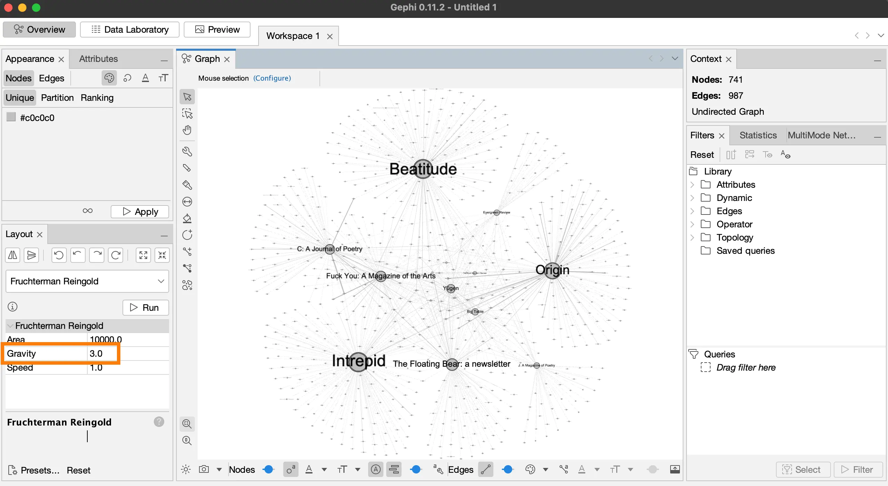
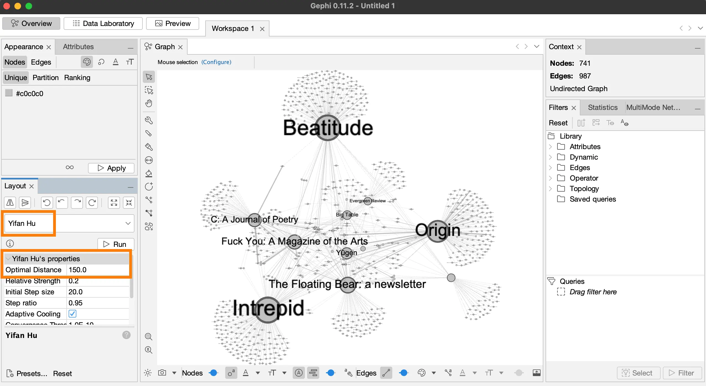
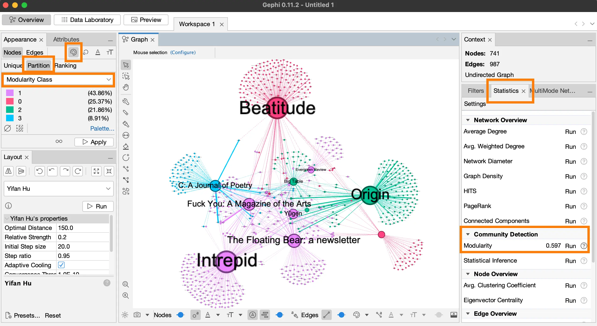

Now that you know your way around the Gephi interface, we can begin using it for network analysis. 
Technically speaking, we ask two fundamental questions in network analysis. 
What does the network structure look like for a given community? 
How are nodes positioned within that structure? 
These two questions allow us to explain the structure of communities relative to each other as well as identify the important actors in the field. 

This post is concerned with community formation, and we will explore different network layouts to render these communities visible. 
Our network diagram is composed of poets and literary journals associated with the five poetry schools in Donald Allen’s _The New American Poetry 1945-1960_ (1960). 
We won’t spend our time looking at each and every school, but we can at least begin to test the claims that Allen makes in the anthology regarding the formation of poetry communities.

Let’s change the network layout to give shape to the communities.

### Step 1: Clustering with Fruchterman Reingold algorithm

First, we will make a copy of the **networking.gephi** file. 
Every time we get a decent result, it’s important to leave that gephi file alone and work on a copy of the file.

- Make a copy of the **networking.gephi** file, and rename the copy to **yifanhu.gephi**.
- Open Gephi. In the **Welcome** dialog box, click on **Open Graph File...** and open your **yifanhu.gephi** file.

In the last post, we used the Fruchterman Reingold algorithm which generates a circular graph. 
It’s perfect when 1. There are disjoint networks, 
2. The network diagram should cover the whole space, or 
3. There aren’t many communities.

Let’s see what we can do with this algorithm in terms of clustering.

- In the **Layout** panel, under **Fruchterman Reingold**, change the **Gravity to 2.0**, and click **Run**. 
Once nodes stop moving, click **Stop** to stop the simulation.
- Click on **Center the graph** (magnifying glass icon).

We begin to see that the literary journals on the periphery—e.g., *Origin*— have a lot of poets who published in that journal only **(fig. 1)**. 
Meaning, these journals are connected only with a few nearby journals. 
However, there are journals in the middle—e.g., *Yūgen*—that are connected to many other journals. 
What we see here are communities forming on the periphery. 

<figcaption>**Figure 1.** Clustering using Fruchterman Reingold layout.</figcaption>

- Hover over a journal node to see how widespread is its connected poet nodes.

In order to make the communities more distinct, we will use the Yifan Hu clustering algorithm. 
This algorithm uses negative space to place nodes with strong ties close to each other in the graph and nodes with weak ties distant from each other.

### Step 2: Yifan Hu layout

- Select **Yifan Hu** layout **(fig. 2)**.
- Change the following parameters, under **Yifan Hu’s properties**:
- **Optimal Distance 150.0**.
- **Convergence Threshold 1.0E-10** (change 4 to 10).
- Click **Run** and then **Center the graph**.
- Save the file: Click **File** > **Save**.

<figcaption>**Figure 2.** Clustering using Yifan Hu layout.</figcaption>

We begin to see the different clusters in the network diagram. 
This dataset seems to have a small sample of literary journals, so there are only a few journals in each distinct cluster. 
For example, *Origin*, *J: A Magazine of Poetry*, *Evergreen Review*, *Big Table*, and *The Black Mountain Review* seem to form a cluster. 
Let’s try to confirm this claim by running the community detection algorithm. 
We will, of course, need some knowledge of these journals to make these claims, but we can still form our research hypothesis based on these preliminary observations.

### Step 3: Community detection
- Click on the **Statistics** tab on the right panel **(fig. 3)**. 
Under **Community Detection** section, click **Run** next to the **Modularity Class**.
- In the **Modularity Settings** dialog box, change **Resolution to 3**, and click **Ok**.

This will give us four communities. 
When you run the simulation again, the number of communities as well as which journals are in the community will change slightly.

Let’s map these communities into our diagram

- Change the color of the nodes based on these communities in the **Appearance** tab, top left of the screen **(fig. 3)**: 
**Nodes** > **Color** (palette icon) > **Partition** > **Choose an attribute** > **Modularity Class** > **Apply**.
- Save the file: **File** > **Save**.

<figcaption>**Figure 3.** Coloring nodes based on communities.</figcaption>

According to the community detection algorithm, *Origin*, *Big Table*, and *The Black Mountain Review* (green color) are in the same community **(fig. 3)**. 
The biggest cluster is in purple color.

Let’s export the image

### Step 4: Export the image
- Go to the **Preview** tab, and under **Presets**, select **demo** (our saved configuration).
- Go to the **Export** option at the bottom left of the screen, click on **SVG/PDF/PNG**. 
Change image settings: Click on **Options...** In this dialog box, change **Width 7680** > **Height 4320** > **Ok**.
Save the image in the **begin** forlder: **Save In** > **gephi-intro** folder > **begin** folder > **Files of Type: PNG files** > **File Name: networking-web.png**. 
Click **Save**.